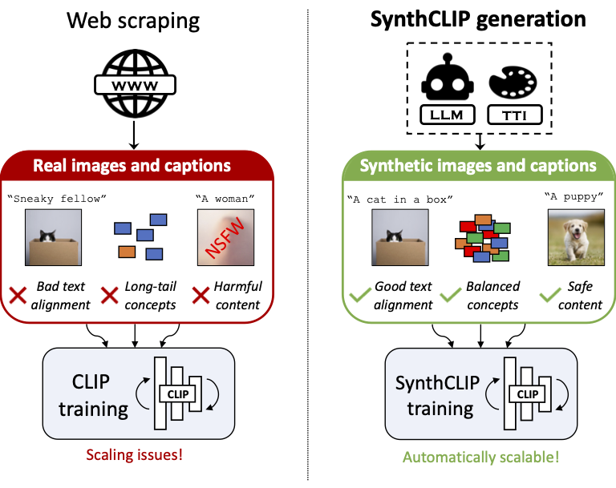

# SynthCLIP: Are We Ready For a Fully Synthetic CLIP Training?



[[Paper]](https://google.com)  

In this repository, we will share the data, code, and trained models for our work. Stay tuned and star!

## Abstract
We present SynthCLIP, a novel framework for training CLIP models with entirely synthetic text-image pairs, significantly departing from previous methods relying on real data. Leveraging recent text-to-image (TTI) generative networks and large language models (LLM), we are able to generate synthetic datasets of images and corresponding captions at any scale, with no human intervention. With training at scale, SynthCLIP achieves performance comparable to CLIP models trained on real datasets. We also introduce SynthCI-30M, a purely synthetic dataset comprising 30 million captioned images.

## Citation

```
 @article{hammoud2024synthclip,
  title={{SynthCLIP: Are We Ready For a Fully Synthetic CLIP Training?}},
  author={Hammoud, Hasan and Itani, Hani and Pizzati, Fabio and Torr, Philip and Bibi, Adel and Ghanem, Bernard},
  journal={arXiv},
  year={2024}
}
```
